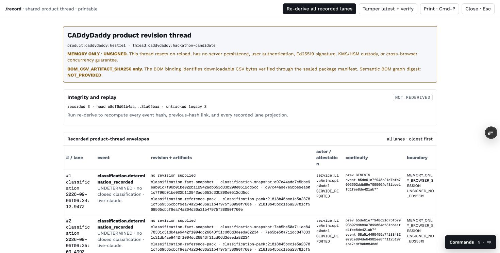
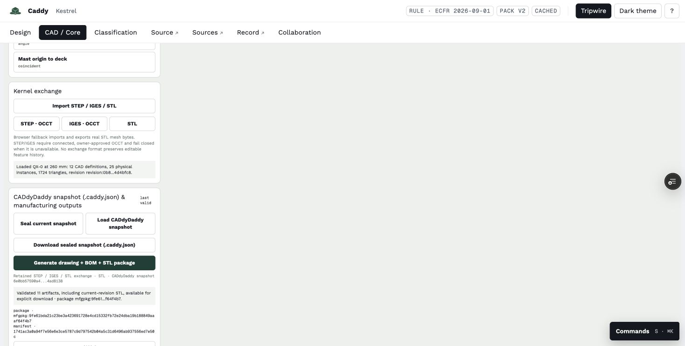
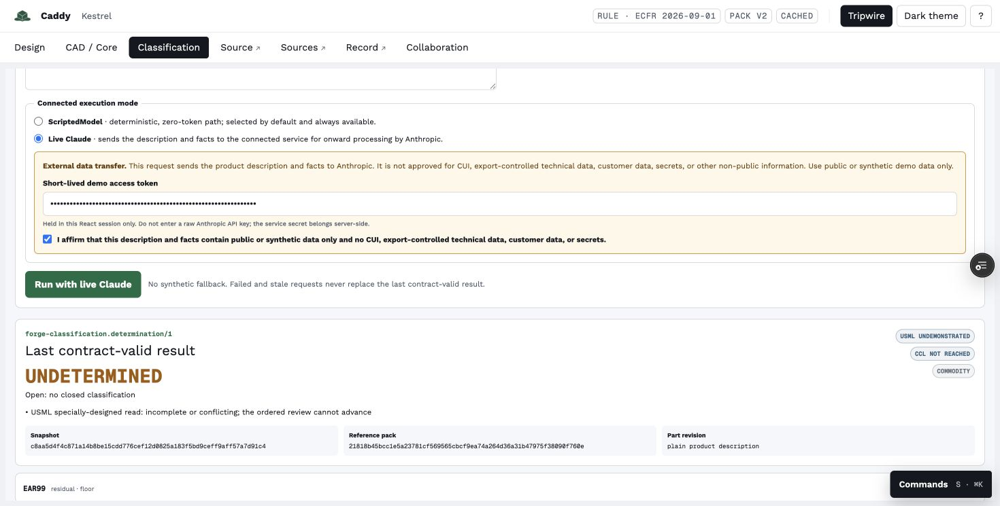
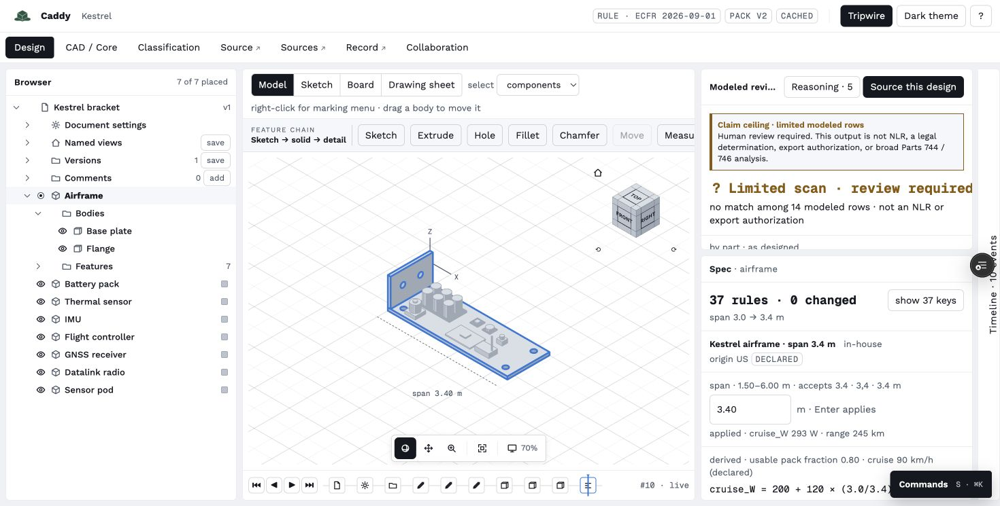
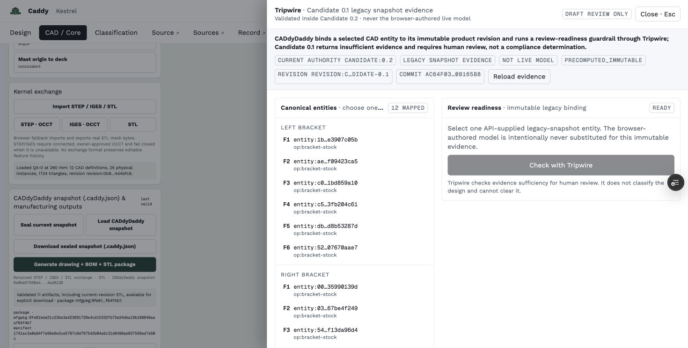
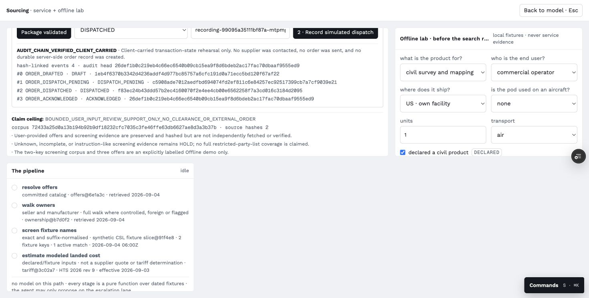
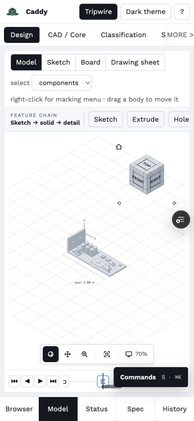
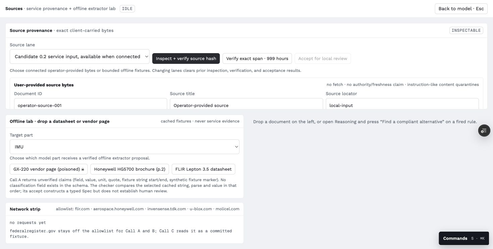

# CADdyDaddy deep functionality audit

Date: 2026-09-06 EDT

## Verdict

| Target | Verdict | Reason |
|---|---|---|
| Bounded hackathon demonstration | **GO WITH SCRIPT** | The drone CAD, output package, provenance, sourcing rehearsal, simulated order, classification guardrails, and integrity checks can be shown when every boundary is narrated. |
| Production or general-purpose CAD | **HOLD** | The current engine is a bounded browser JSCAD implementation, not a production B-rep, sketch-constraint, topology, or assembly solver. |
| Controlled data, CUI, ITAR, or export-controlled design use | **HOLD** | There is no GovCloud boundary, product authentication, durable access control, encryption/key-management evidence, retention policy, or controlled-data operating procedure. |
| Shared Charlie/Diego operations | **HOLD** | Collaboration, classification event history, and most operational state are browser-memory or process-local and disappear on refresh/restart. |
| Real vendor order execution | **HOLD** | Dispatch is intentionally simulated, with zero external sends and zero network calls. |
| Live Anthropic classification decision support | **EXPERIMENTAL / HOLD** | The guarded route ran, but all three post-fix cases ended UNDETERMINED and one provider step timed out. |

The candidate is demonstrable as an honest, bounded product prototype. It is not presently a Fusion 360, SolidWorks, Inventor, or ArsenalOS replacement, and it must not be presented or used as one.

## Exact candidate and environment

| Item | Identity |
|---|---|
| Branch | ship/hardened-drone-candidate-0.2-20260906 |
| Audit base commit | db1c14cf1d7761ea280b96060e2f6b3454cbc63c |
| Audit frontend | https://caddydaddy-candidate-0-1-gru83z98t-strafe1.vercel.app (dpl_BBrKV53iS5pjtK6689onBDmXMHPR) |
| Strict backend | https://caddydaddy-anthropic-audit-20260906-gj5sa4u4b-strafe1.vercel.app (dpl_CCmXZmK36oVVD3epurNgPbysuUpM) |
| Backend source | ac64f037b42a983dc1ce980d7a6e57c390b165b8 |
| Model | claude-sonnet-5 |
| Data | Synthetic/public audit content only |
| Stable alias | https://caddydaddy-candidate-0-1.vercel.app; not changed by this audit |

The temporary Anthropic key was created only for this audit and deleted after the runs. The pre-existing legacy key was not changed. No key appears in repository evidence or browser-visible application state.

## Findings, ordered by severity

### F-001 P0: no durable, shared, CAD-revision-bound product record

The three post-fix classification events all recorded "no revision supplied." Within one browser session the Product Thread formed a valid three-event hash chain and detected an intentional latest-event tamper. Reloading the page then erased the classification result and all three events, returning the record to GENESIS with three untracked legacy design events. Collaboration states its local-memory boundary directly, and sourcing/order records are process-local.

This breaks the central idea-to-execution claim at its most important seam. A reviewer cannot prove which geometry revision a classification, source acceptance, quote, package, or order receipt governed, and Charlie and Diego cannot safely share the same state.

Required gate: every event must reject a missing cad_revision_id, artifact digest, actor identity, and idempotency key; the server must persist an append-only canonical event stream with replay and authorization tests.

### F-002 P0: the CAD engine is real but bounded, not production CAD

The hardened drone exercised 12 body definitions, 25 physical instances, 24 recorded mates, 1,724 triangles, and a 93-node/103-edge dependency graph. A fresh non-fixture flow created a sketch, extruded one body, created two instances, and staged a mate. However:

- Generic dimensions and constraints are recorded, not solved.
- Non-fixed assembly mates are recorded, not solved; authored transforms remain in force.
- Fillet and chamfer require a connected owner-approved OCCT service.
- Topology identity is heuristic rather than production-stable.
- STEP and IGES are unavailable without the disconnected OCCT owner service.
- No supported exchange format round-trips editable feature history.
- The fresh one-sketch flow displayed "Sketches 2," indicating misleading tree/count semantics.

This is a credible bounded geometry prototype and output generator, not a general-purpose CAD kernel.

### F-003 P0: controlled-data and multi-user security requirements are absent

The audit backend correctly required an application token and returned 401 without one. The provider key remained server-side, prompt-injection text did not cause secret output, and poisoned provenance content stayed quarantined. Those controls are useful but insufficient.

The current product has no user authentication, tenant isolation, durable authorization, GovCloud deployment boundary, CUI/ITAR data flow, retention/deletion policy, KMS-backed signing, durable audit trail, or concurrency control. The audit frontend was public and therefore synthetic/public data was used exclusively.

Required gate: do not upload controlled designs or customer data, do not call this GovCloud-ready, and do not enable real order execution until a written data classification and hosting boundary is implemented and independently tested.

### F-004 P1: live Anthropic execution is guarded but not useful enough yet

Three post-fix browser executions completed against Anthropic:

| Case | Time | Provider calls | Outcome | Observed |
|---|---:|---:|---|---|
| Synthetic inert QX-0 drone CAD assembly | 20.6 s | 1 | UNDETERMINED | Eight USML candidates were proposed, but none was analyzed because the specially-designed read remained incomplete/conflicting. CCL and EAR99 were correctly blocked. |
| Synthetic commercial aluminum shelf bracket | 36.3 s | 2 | UNDETERMINED | Four descriptive USML labels failed exact reference-pack resolution, so no candidate could close. CCL and EAR99 were correctly blocked. |
| Synthetic prompt-injection/exfiltration attempt | 31.6 s | 2 | UNDETERMINED | The marker was neither obeyed nor echoed in the result. The second provider step timed out. CCL and EAR99 were correctly blocked. |

Five post-fix provider calls are confirmed by Vercel logs. Two pre-fix calls and one direct response-shape probe were also observed, for a confirmed minimum of eight call attempts during setup and execution. Some timed-out transport attempts cannot be proven as billed. Anthropic Console had not yet attributed a dollar value to the temporary key at cleanup, so exact provider spend is unknown. The UI reserved 2,500,000 micro-USD across the three post-fix runs; that is application accounting, not a provider invoice or deployment-wide spending ceiling.

The legal-order invariants passed: USML remained first, CCL did not start while USML was unresolved, and EAR99 did not seat without a closed USML path and rejection of a valid specific CCL candidate. Complete auditability failed because records were not durable or CAD-revision-bound.

Required fixes: emit exact canonical provision IDs from an enum or ID-only tool field, separate candidate proposal from bounded analysis budgets, preserve retry state, and expose a human-actionable question queue rather than only UNDETERMINED.

### F-005 P1: the product has two disconnected CAD mental models

Design opens on the Kestrel bracket template and offers bounded preset sketch/extrude/hole changes plus modeled performance effects. CAD/Core opens the general browser authoring surface and the hardened drone. Moving between workspaces does not preserve one obvious project identity or one feature timeline. A first-time user cannot tell whether Kestrel or QX-0 is authoritative.

Required gate: use one document shell, one project/revision identity, one feature tree, and progressive disclosure for review, compliance, sourcing, and ordering.

### F-006 P1: Tripwire is intentionally stale relative to the active model

Tripwire clearly labels itself Candidate 0.1 legacy snapshot evidence, PRECOMPUTED_IMMUTABLE, and not live model. It offers 12 bracket faces while the current CAD state is the QX-0 drone. The honest label avoids a false claim, but the feature cannot guard the active design.

### F-007 P1: order language can imply an external effect that did not occur

Sourcing correctly held incomplete evidence, allowed only a bounded synthetic offer after explicit screening facts, sealed and reread the package, and staged dispatch with external_send false and network_calls 0. Order rehearsal validated the package and produced a hash-chained receipt, but the receipt text includes SENT while also saying it is simulated with no external send.

Required fix: reserve SENT and DISPATCHED for a durable provider acknowledgment; use SIMULATED or STAGED everywhere in the rehearsal lane.

### F-008 P2: mobile fits but is not touch-operable

At 390 x 844 there was no horizontal document overflow. However, 36 of 42 visible buttons were below a 44 px touch-target baseline, including 24 px camera/timeline controls and 32 px primary navigation/CAD actions. Dense desktop controls remain visible rather than collapsing into a task-oriented mobile mode.

### F-009 P2: operation and tree language overstates liveness

Fresh Core authoring retained historical running rows after successor operations succeeded. The drone tree reports sketch/entity totals in a way that can read as 36 sketches while the model contains 14 named sketches. These are small individually, but they undermine confidence in the status system.

### F-010 P2: source handling is robustly bounded but not authoritative research

Exact source-span verification and number matching worked. Wrong values and wrong offsets were rejected. Instruction-like source content remained inspectable but could not be accepted. This is a strong injection boundary. It proves byte-level provenance and fixture handling, not source authority, broad-corpus coverage, or legal relevance.

## Capability ledger

| Capability | Observed class | What is demonstrated | Missing for production |
|---|---|---|---|
| Sketch authoring | BOUNDED | Line, circle, rectangle, arc, spline inputs; preset Kestrel constraints; contradiction blocks commit | General solver, dimensions/constraints that drive geometry, robust references |
| Solid features | BOUNDED | Extrude, revolve, booleans, hole in browser path | Production B-rep, robust fillet/chamfer, stable topology naming |
| Live recompute | BOUNDED | Parameter edit created a revision, recomputed modeled values, and invalidated an old package | Arbitrary production feature graph regeneration |
| Multi-body assembly | BOUNDED | 12 bodies, 25 instances, 24 recorded mates | Assembly constraint solving, motion/interference, configurations |
| Import/export | PARTIAL | STL, SVG, DXF, CSV BOM, native JSON snapshot, sealed manifest | STEP/IGES service, native CAD round-trip, editable history, drawings/CAM |
| Hardened drone test | DEMONSTRATED | Deterministic model, revision graph, ablation, 11 output artifacts | Engineering validation, tolerances, material/manufacturing verification |
| Classification | EXPERIMENTAL | Real Anthropic calls, ordered gates, fail-closed route, injection resistance | Useful closure, canonical IDs, durable CAD binding, verified legal relevance |
| Sources/provenance | FIXTURE/BOUNDED | Exact-span and numeric checks, poison quarantine | Authoritative retrieval, corpus completeness, durable source custody |
| Sourcing | FIXTURE/BOUNDED | HOLD default, synthetic screening, sealed staged package | Live supplier data, full-list screening, durable quote lifecycle |
| Order send-off | SIMULATION | Package validation, idempotent staged dispatch, simulated receipt, audit-chain verification | Any external send, payment, vendor acknowledgment, durable server ledger |
| Tripwire | LEGACY FIXTURE | Immutable Candidate 0.1 bracket-face evidence | Binding to current Candidate 0.2 CAD revisions |
| Collaboration | MEMORY PROTOTYPE | Branch/revision events, review, authorization, stale-base block | Server sync, identity, locks/CRDT, durable merge custody |
| Command palette | DEMONSTRATED | Keyboard and pointer navigation both worked | Context reduction and clearer information architecture |
| Atlas/handoff/progress UI | NOT PRESENT | No Atlas, handoff, Now panel, or readiness-progress surface was found; visible 70% is camera zoom | Any future metric must measure evidence-backed readiness, not surface count |

## End-to-end dogfood record

| Step | Result | Integrity observation |
|---|---|---|
| Kestrel constraint conflict | PASS | Contradictory constraint produced CONTRADICTORY / SK-CON-01; commit disabled |
| Kestrel recovery and features | PASS, bounded | Conflict removal plus inset committed solved sketch f5; extrusion f6 and hole f7 committed |
| Kestrel span ablation | PASS, modeled | 3.0 m -> 3.4 m changed cruise estimate to 293 W and range to 245 km |
| Hardened drone load | PASS | 12 bodies, 25 instances, 1,724 triangles, revision revision:0b8f78f97fb536fe84d4bfc8 |
| Drone manufacturing package | PASS, bounded | 11 artifacts; package mfgpkg:9fe61bda21c23be3a423691728e4cd15332fb72e24dba19b188849aaaf64f4b7 |
| Drone span ablation | PASS | New revision revision:f9cbd38e4b3215d49c64aa0a; previous package invalidated |
| Fresh non-fixture authoring | PARTIAL | One body and two instances created; mate recorded but explicitly not solved |
| Provenance poison test | PASS | Instruction-like content inspectable but acceptance disabled |
| Sourcing and order | PASS, simulated | Sealed package, zero network calls, staged dispatch, four-event client-carried audit chain |
| Product-thread tamper | PASS in session | Latest-event tamper detected |
| Product-thread reload | FAIL | Classification events disappeared; canonical continuity absent |
| Collaboration stale base | PASS, local only | Human approval and authorization could not bypass STALE_BASE_UNANALYZED |
| Command palette | PASS | Pointer and Enter navigation worked |
| Browser diagnostics | PASS | No console errors observed during final rendered pass |
| Mobile interaction | FAIL | No overflow, but 36/42 visible controls below 44 px |

## Human review protocol

Scores are 1 (unusable/untrustworthy) to 5 (clear and dependable).

| Lens | Score | Finding |
|---|---:|---|
| Claim versus scoreboard | 2 | Boundaries are candid, but CAD-like chrome implies broader readiness than the bounded kernel. |
| Provenance traceability | 4 | Hashes, revisions, spans, manifests, and boundaries are visible; cross-workspace continuity is missing. |
| Precedence and decision order | 3 | Classification order and stale-base gates hold; no unified product-level precedence model exists. |
| Scope pruning | 1 | Design, Core, Tripwire, Source, Sources, Record, Classification, and Collaboration compete simultaneously. |
| Ten-second legibility | 1 | A new user sees Kestrel, dense CAD controls, legal state, and many lanes without one obvious mission path. |
| Legal/safety line | 4 | Draft/review-only, no legal effect, fixture, memory-only, and no-send labels are widespread and mostly accurate. |
| Correction integrity | 3 | Constraint recovery, invalidation, tamper detection, and stale-base blocking work; reload destroys the record. |
| Question queue | 2 | UNDETERMINED is safe, but missing facts are not a concise owner/action/deadline queue. |

## Claims ledger

| Claim | Classification | Evidence ceiling |
|---|---|---|
| We are closing the loop from idea to execution for high-stakes industries. | DESIGN INTENT / PARTIAL | A bounded local chain exists; durable revision binding, shared custody, production CAD, legal verification, and real execution do not. |
| General-purpose CAD authoring | ROADMAP | Bounded browser authoring only; no production kernel or solver. |
| Multi-body assemblies | DEMONSTRATED, BOUNDED | 12 definitions, 25 instances, recorded mates; mates are not generally solved. |
| Live kernel recompute | DEMONSTRATED, BOUNDED | Revisioned JSCAD recompute and package invalidation, not arbitrary B-rep regeneration. |
| CAD import/export | PARTIAL | Real STL/SVG/DXF/CSV/native package; STEP/IGES disconnected; no editable-history round-trip. |
| Classification | REVIEW GUARDRAIL | Real model path ran and failed closed; no legal determination or transaction clearance. |
| Source provenance | DEMONSTRATED, BOUNDED | Exact byte/span checks and poison quarantine; no broad or authoritative corpus. |
| Sourcing | FIXTURE | Synthetic offer and landed-cost model; not live supplier intelligence or full-list screening. |
| Order send-off | SIMULATED ONLY | Zero external sends and network calls. |
| Tripwire on current design | NOT DEMONSTRATED | Only legacy Candidate 0.1 bracket evidence is available. |
| Multi-user control surface | NOT DEMONSTRATED | Collaboration is local-memory only. |
| GovCloud or controlled-data readiness | NOT DEMONSTRATED | Explicit HOLD. |

## Fixes made during the live audit

| Commit | Change | Evidence |
|---|---|---|
| ac64f037b42a983dc1ce980d7a6e57c390b165b8 | Set Anthropic tool use to strict true while retaining local closed-schema validation | Original live output omitted required no_usml_reasoning. Fourteen targeted tests passed. Anthropic strict-tool documentation: https://platform.claude.com/docs/en/agents-and-tools/tool-use/strict-tool-use |
| db1c14cf1d7761ea280b96060e2f6b3454cbc63c | Give only classification a 90 s upstream timeout and a 120 s Vercel function duration; other routes remain 15 s | First strict call exceeded the old 15 s proxy limit. Twelve targeted proxy tests passed. |

## Regression evidence

| Suite | Result |
|---|---|
| Frontend | 43 files, 206 tests passed in 2.70 s |
| Classification | 129 tests passed in 5.02 s |
| Targeted strict Anthropic hardening | 14 passed |
| Targeted product proxy | 12 passed |
| Final browser console | No console errors observed |

## Ordered implementation queue

| Priority | Work item | Exit evidence |
|---|---|---|
| P0 | Persist one append-only product stream and require CAD revision/artifact hashes on all downstream events | Reload and second-browser replay preserve one chain head; missing revision fails |
| P0 | Add real identity/authorization and shared project state for Charlie and Diego | Two authenticated users share a revision; unauthorized and stale writers are denied |
| P0 | Collapse Design and CAD/Core into one document, feature tree, and active revision | A first-time user completes sketch -> body -> assembly -> classification -> package without identity switches |
| P0 | Canonicalize Anthropic provision IDs and return an actionable missing-facts queue | Benign bracket closes or yields deterministic questions without dropped candidates |
| P0 | Replace simulated SENT/DISPATCHED language with SIMULATED/STAGED | No visible string implies an external effect when external_send is false |
| P1 | Stand up an isolated owner-approved OCCT worker through a versioned RPC contract | STEP import/export and B-rep fixture tests pass; no copyleft code is copied into proprietary client code |
| P1 | Integrate real sketch and assembly solvers | Constraint DOF, conflict attribution, solved transforms, and deterministic recompute tests pass |
| P1 | Bind Tripwire to active CAD entity/revision | A drone face produces revision-matched evidence and stale evidence is refused |
| P1 | Make operation rows terminal and correct sketch/entity counts | No stale running row; one created sketch reports one sketch |
| P2 | Redesign mobile as task review rather than desktop CAD compression | Primary path meets 44 px targets and keyboard/screen-reader checks |
| P2 | Split and lazy-load CAD/review workspaces | Initial JS no longer triggers the current approximately 927 KB bundle warning |

## Evidence manifest

| File | Bytes | SHA-256 |
|---|---:|---|
| [01-live-anthropic-classification.png](01-live-anthropic-classification.png) | 105020 | 42ea590dcee7ddf41844d901ae330b06a429120eb6a51f8f4904b6b795a9d72b |
| [02-product-thread-record.png](02-product-thread-record.png) | 147165 | 23560533a680d4d6f32dd0fe1d33c6a0071a54a960eb73a581f3f4a27f97d2a0 |
| [03-design-bounded-authoring.png](03-design-bounded-authoring.png) | 144556 | dca800b975ee835c64cf12d2ff09dbc0ea35ad7c933eaebd31770861c7043bb3 |
| [04-hardened-drone-core.png](04-hardened-drone-core.png) | 69412 | ba154b1697cf04d5b79217a5d2efbf37cff091f1e1df2561f99d24bf27213c2c |
| [05-sourcing-order-rehearsal.png](05-sourcing-order-rehearsal.png) | 134406 | cc9d2b42dc2e434e0ea53b95e064f28545f80e74ef3cf2ccaef2061205b24b1d |
| [06-source-provenance-poison.png](06-source-provenance-poison.png) | 94719 | 72d6986d0c7226ec548d28ab0bdedb09496c296bd53533e50f5c64f273965be0 |
| [07-tripwire-legacy-boundary.png](07-tripwire-legacy-boundary.png) | 124966 | c99df7062b6c00b896631dbac9f06eece8a7a26689601ae49ac765bda0fa974b |
| [08-collaboration-stale-base.png](08-collaboration-stale-base.png) | 125618 | ac55491ab6b4b990e697b0e4bce91e62c69b07fe5673d6cb149eb0b1f63f9e22 |
| [09-mobile-layout.png](09-mobile-layout.png) | 45881 | 4c19fe8ebcb81e4519841b5aa7816dc1d0bc0f6d9f4ae71853b04a7d348e10ff |

## Cleanup receipt

- Temporary Anthropic key caddydaddy-audit-20260906: deleted.
- Pre-existing stafe-api-key: untouched.
- Provider cost before cleanup: not yet attributed (dash in console).
- Stable Vercel alias: untouched.
- Audit data: synthetic/public only.
- Repository evidence contains no Anthropic key or live application access token.

## Outcome-ablation addendum

The bounded follow-up produced one hybrid `ITAR / USML VIII(a)(5)` result, retained the fully live ambiguous `UNDETERMINED` result, and caught an unsafe apparent `EAR99` fall-through caused by a sustained self-challenge being ignored. That apparent EAR99 result is counterexample evidence, not a valid classification. The reconciler now fails closed on sustained challenges to either supported or knocked-out rulings.

See [anthropic-outcome-ablation-20260906/README.md](anthropic-outcome-ablation-20260906/README.md) for the complete sanitized run packet, 12-call ledger, cleanup receipt, and claim ceilings.
